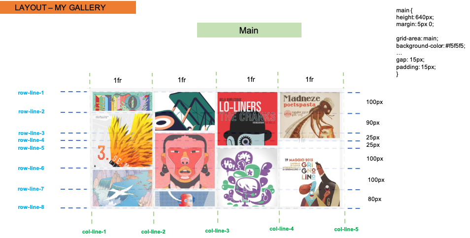

# Grid Document Layout

#### Insructions
- Using CSS Grid (and Flexbox if you like) recreate the reference layout below.
- Work in the existing `index.html` file
### Images
- You will find all immages in the `images` folder

### Hints
- Use `grid-template-columns`, `grid-template-rows` and `grid-template-areas`to create the layout.
- Use `grid-gap` for the margins between colimns and rows.

## Layout designs

### Make use of the images and information below to come to the best solution -

- The whole document

- Main section

- Second part

- Footer

## The online version

In order to see live version, just [click...!](https://hsnakk.github.io/UIB_Layout_Grid_Exercise-1/)

#### Good luck and have fun!